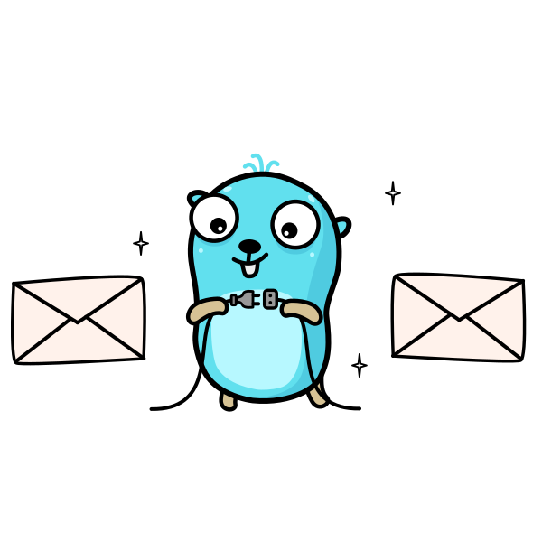

<p align="center">
  
  <h3 align="center">Go Mail</h3>
  <p align="center">A cross platform mail driver for GoLang.</p>
  <p align="center">
		<a href="https://github.com/ainsleyclark/go-mail/actions/workflows/test.yml"></a>
    <a href="/LICENSE.md"></a>
		<a href="https://codecov.io/gh/ainsleyclark/go-mail"></a>
    <a href="https://goreportcard.com/report/github.com/ainsleyclark/go-mail"></a>
    <a href="https://pkg.go.dev/github.com/ainsleyclark/go-mail"></a>
  </p>
</p>

## Overview

- ✅ Multiple mail drivers for your needs or even create your own custom Mailer.
- ✅ Direct dependency free, all requests are made with the standard lib http.Client.
- ✅ Send attachments with two struct fields, it's extremely simple.
- ✅ Send CC & BCC messages.
- ✅ Extremely lightweight.

## Supported API's

-   [Mailgun](https://documentation.mailgun.com/)

-  [Postal](https://docs.postalserver.io/)

-  [Postmark](https://postmarkapp.com/)

-  [SendGrid](https://sendgrid.com/)

-  [SparkPost](https://www.sparkpost.com/)

-  SMTP

## Introduction

Go Mail aims to unify multiple popular mail API's into a singular easy to use interface. Email sending is seriously simple and great for allowing the developer to
choose what platform they use.

```go
cfg := mail.Config{
    URL:         "https://api.eu.sparkpost.com",
    APIKey:      "my-key",
    FromAddress: "hello@gophers.com",
    FromName:    "Gopher",
}

mailer, err := drivers.NewSparkPost(cfg)
if err != nil {
	log.Fatalln(err)
}

tx := &mail.Transmission{
    Recipients:  []string{"hello@gophers.com"},
    Subject:     "My email",
    HTML:        "<h1>Hello from Go Mail!</h1>",
}

result, err := mailer.Send(tx)
if err != nil {
	log.Fatalln(err)
}

fmt.Printf("%+v\n", result)
```

## Installation

```bash
go get -u github.com/ainsleyclark/go-mail
```

## Docs

Documentation can be found at the [Go Docs](https://pkg.go.dev/github.com/ainsleyclark/go-mail), but we have included a kick start guide below to get you started.

### Creating a new client:

You can create a new driver by calling the `drivers` package and passing in a configuration type which is  needed to create a new mailer, each platform requires its own data,
for example, Mailgun requires a domain, but SparkPost doesn't.
This is based of the requirements for the API. For more details see the examples above.

```go
cfg := mail.Config{
    URL:         "https://api.eu.sparkpost.com",
    APIKey:      "my-key",
    FromAddress: "hello@gophers.com",
    FromName:    "Gopher",
}

mailer, err := drivers.NewSparkpost(cfg)
if err != nil {
	log.Fatalln(err)
}
```

### Sending Data:

A transmission is required to transmit to a mailer as shown below. Once send is called, a `mail.Result` and error will be returned
indicating if the transmission was successful.

```go
tx := &mail.Transmission{
	Recipients: []string{"hello@gophers.com"},
	CC:         []string{"cc@gophers.com"},
	BCC:        []string{"bcc@gophers.com"},
	Subject:    "My email",
	HTML:       "<h1>Hello from Go Mail!</h1>",
	PlainText:  "Hello from Go Mail!",
}

result, err := mailer.Send(tx)
if err != nil {
	log.Fatalln(err)
}

fmt.Printf("%+v\n", result)
```

### Adding attachments:

Adding attachments to the transmission is as simple as passing a byte slice and filename,
Go Mail takes care of the rest for you.

```go
image, err := ioutil.ReadFile("gopher.jpg")
if err != nil {
	log.Fatalln(err)
}

tx := &mail.Transmission{
	Recipients: []string{"hello@gophers.com"},
	Subject:    "My email",
	HTML:       "<h1>Hello from Go Mail!</h1>",
	PlainText:  "plain text",
	Attachments: []mail.Attachment{
		{
			Filename: "gopher.jpg",
			Bytes:    image,
		},
	},
}
```

## Examples

#### Mailgun

```go
cfg := mail.Config{
URL:         "https://api.eu.mailgun.net", // Or https://api.mailgun.net
	APIKey:      "my-key",
	FromAddress: "hello@gophers.com",
	FromName:    "Gopher",
	Domain:      "my-domain.com",
}

mailer, err := drivers.NewMailgun(cfg)
if err != nil {
	log.Fatalln(err)
}

tx := &mail.Transmission{
	Recipients: []string{"hello@gophers.com"},
	CC:         []string{"cc@gophers.com"},
	BCC:        []string{"bcc@gophers.com"},
	Subject:    "My email",
	HTML:       "<h1>Hello from Go Mail!</h1>",
	PlainText:  "Hello from Go Mail!",
}

result, err := mailer.Send(tx)
if err != nil {
	log.Fatalln(err)
}

fmt.Printf("%+v\n", result)
```

#### Postal

```go
cfg := mail.Config{
	URL:         "https://postal.example.com",
	APIKey:      "my-key",
	FromAddress: "hello@gophers.com",
	FromName:    "Gopher",
}

mailer, err := drivers.NewPostal(cfg)
if err != nil {
	log.Fatalln(err)
}

tx := &mail.Transmission{
	Recipients: []string{"hello@gophers.com"},
	CC:         []string{"cc@gophers.com"},
	BCC:        []string{"bcc@gophers.com"},
	Subject:    "My email",
	HTML:       "<h1>Hello from Go Mail!</h1>",
	PlainText:  "Hello from Go Mail!",
}

result, err := mailer.Send(tx)
if err != nil {
	log.Fatalln(err)
}

fmt.Printf("%+v\n", result)
```

#### Postmark

```go
cfg := mail.Config{
	APIKey:      "my-key",
	FromAddress: "hello@gophers.com",
	FromName:    "Gopher",
}

mailer, err := drivers.NewPostmark(cfg)
if err != nil {
	log.Fatalln(err)
}

tx := &mail.Transmission{
	Recipients: []string{"hello@gophers.com"},
	CC:         []string{"cc@gophers.com"},
	BCC:        []string{"bcc@gophers.com"},
	Subject:    "My email",
	HTML:       "<h1>Hello from Go Mail!</h1>",
	PlainText:  "Hello from Go Mail!",
}

result, err := mailer.Send(tx)
if err != nil {
	log.Fatalln(err)
}

fmt.Printf("%+v\n", result)
```

#### SendGrid

```go
cfg := mail.Config{
	APIKey:      "my-key",
	FromAddress: "hello@gophers.com",
	FromName:    "Gopher",
}

mailer, err := drivers.NewSendGrid(cfg)
if err != nil {
	log.Fatalln(err)
}

tx := &mail.Transmission{
	Recipients: []string{"hello@gophers.com"},
	CC:         []string{"cc@gophers.com"},
	BCC:        []string{"bcc@gophers.com"},
	Subject:    "My email",
	HTML:       "<h1>Hello from Go Mail!</h1>",
	PlainText:  "Hello from Go Mail!",
}

result, err := mailer.Send(tx)
if err != nil {
	log.Fatalln(err)
}

fmt.Printf("%+v\n", result)
```

#### SMTP

```go
cfg := mail.Config{
	URL:         "smtp.gmail.com",
	FromAddress: "hello@gophers.com",
	FromName:    "Gopher",
	Password:    "my-password",
	Port:        587,
}

mailer, err := drivers.NewSMTP(cfg)
if err != nil {
	log.Fatalln(err)
}

tx := &mail.Transmission{
	Recipients: []string{"hello@gophers.com"},
	CC:         []string{"cc@gophers.com"},
	BCC:        []string{"bcc@gophers.com"},
	Subject:    "My email",
	HTML:       "<h1>Hello from Go Mail!</h1>",
	PlainText:  "Hello from Go Mail!",
}

result, err := mailer.Send(tx)
if err != nil {
	log.Fatalln(err)
}

fmt.Printf("%+v\n", result)
```

#### SparkPost

```go
cfg := mail.Config{
	URL:         "https://api.eu.sparkpost.com", // Or https://api.sparkpost.com/api/v1
	APIKey:      "my-key",
	FromAddress: "hello@gophers.com",
	FromName:    "Gopher",
}

mailer, err := drivers.NewSparkPost(cfg)
if err != nil {
	log.Fatalln(err)
}

tx := &mail.Transmission{
	Recipients: []string{"hello@gophers.com"},
	CC:         []string{"cc@gophers.com"},
	BCC:        []string{"bcc@gophers.com"},
	Subject:    "My email",
	HTML:       "<h1>Hello from Go Mail!</h1>",
	PlainText:  "Hello from Go Mail!",
}

result, err := mailer.Send(tx)
if err != nil {
	log.Fatalln(err)
}

fmt.Printf("%+v\n", result)
```

## Writing a Mailable

You have the ability to create your own custom Mailer by implementing the singular method interface shown below.

```go
type Mailer interface {
	// Send accepts a mail.Transmission to send an email through a particular
	// driver/provider. Transmissions will be validated before sending.
	//
	// A mail.Response or an error will be returned. In some circumstances
	// the body and status code will be attached to the response for debugging.
	Send(t *Transmission) (Response, error)
}
```

## Debugging

To debug any errors or issues you are facing with Go Mail, you are able to change the `Debug` variable in the
`mail` package. This will write the HTTP requests in curl to stdout. Additional information will also be
displayed in the errors such as method operations.

```go
mail.Debug = true
```

## Development

### Setup

To get setup with Go Mail simply clone the repo and run the following:

```bash
go get github.com/vektra/mockery/v2/.../
make setup
make mocks
```

## Env

All secretes are contained within the `.env` file for testing drivers. To begin with, make a copy of the `.env.example`
file and name it `.env`. You can the set the environment variables to match your credentials for the mail drivers.

You can set the recipients of emails by modifying the the `EMAIL` variables as show below.

- `EMAIL_TO`: Recipients of test emails in a comma delimited list.
- `EMAIL_CC`: CC recipients of test emails in a comma delimited list.
- `EMAIL_BCC`: BCC recipients of test emails in a comma delimited list.

### Testing

To run all driver tests, execute the following command:

```bash
make test-driver
```

To run a specific driver test, prepend the `driver` flag as show below:

```bash
make test-driver driver=sparkpost
```

The driver flag can be one of the following:

- `mailgun`
- `postal`
- `postmark`
- `sendgrid`
- `smtp`
- `sparkpost`

## TODO

- Add headers to transmission
- Add templates to providers - Sparkpost et al.

## Contributing

We welcome contributors, but please read the [contributing document](CONTRIBUTING.md) before making a pull request.

## Licence

Code Copyright 2021 Go Mail. Code released under the [MIT Licence](LICENCE).
