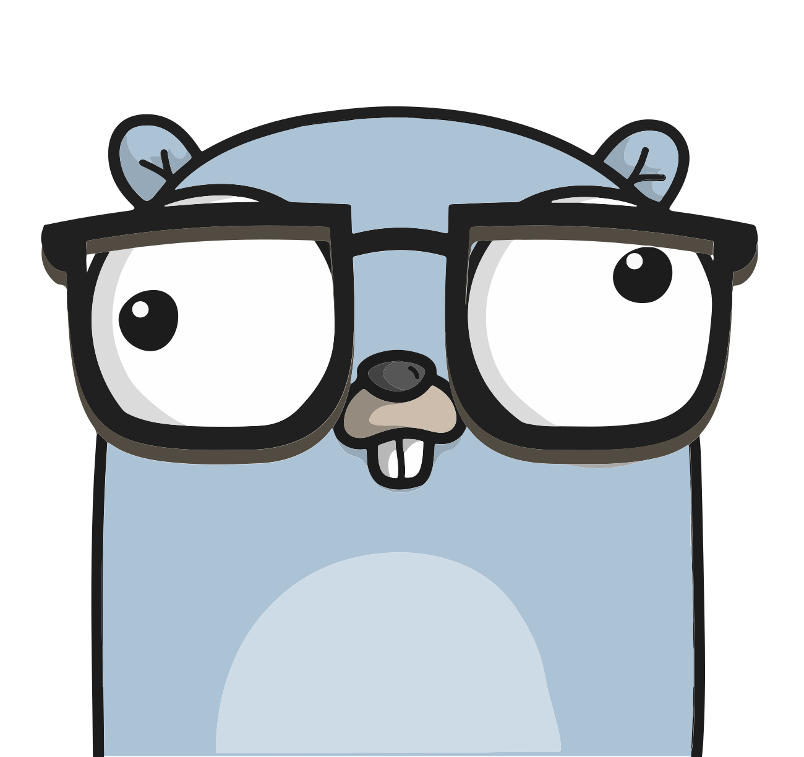

<p align="center">
  
  <h3 align="center">Go Mail</h3>
  <p align="center">A cross platform mail driver for GoLang.</p>
  <p align="center">
    <a href="https://travis-ci.com/ainsleyclark/go-mail"></a>
    <a href="/LICENSE.md"></a>
    <a href='https://coveralls.io/github/ainsleyclark/go-mail?branch=main'></a>
    <a href="https://goreportcard.com/report/github.com/ainsleyclark/go-mail"></a>
    <a href="https://pkg.go.dev/github.com/ainsleyclark/go-mail"></a>
  </p>
</p>

## Introduction

Go Mail aims to unify multiple popular mail API's (SparkPost, MailGun, SendGrid & SMTP) into a singular easy to use interface. Email sending is seriously simple and great for allowing the developer to 
choose what platform they use. 


```go
cfg := mail.Config{
    URL:         "https://api.eu.sparkpost.com",
    APIKey:      "my-key",
    FromAddress: "hello@gophers.com",
    FromName:    "Gopher",
}

driver, err := mail.NewClient(mail.SparkPost, cfg)
if err != nil {
    fmt.Println(err)
    return
}

tx := &mail.Transmission{
    Recipients:  []string{"hello@gophers.com"},
    Subject:     "My email",
    HTML:        "<h1>Hello from go mail!</h1>",
}

result, err := driver.Send(tx)
if err != nil {
    fmt.Println(err)
    return
}

fmt.Println(result)
```

## Installation

```bash
go get -u github.com/ainsleyclark/go-mail
```

## Supported API's

Currently, Sparkpost, MailGun and SendGrid is supported, if you want to see more, just submit a feature request or create a new Driver and
submit a pull request.

| API         | Dependency                                                                   | Examples                      |
|-------------|------------------------------------------------------------------------------|-------------------------------|
| SparkPost   | [github.com/SparkPost/gosparkpost](https://github.com/SparkPost/gosparkpost) | [Here](examples/sparkpost.go) |
| MailGun     | [github.com/mailgun/mailgun-go/v4](github.com/mailgun/mailgun-go/v4])        | [Here](examples/mailgun.go)   |
| SendGrid    | [github.com/sendgrid/sendgrid-go](github.com/sendgrid/sendgrid-go)           | [Here](examples/sendgrid.go)  |
| SMTP        |  None - only use in development.                                             | [Here](examples/smtp.go)      |

## Docs

Documentation can be found at the [Go Docs](https://pkg.go.dev/github.com/ainsleyclark/go-mail), but we have included a kick start guide below to get you started.

### Creating a new client:

The driver type is the first argument to be passed to the `NewClient` function, being one of the following:

- `mail.SparkPost`
- `mail.MailGun`
- `mail.SendGrid`
- `mail.SMTP`

A new configuration type is needed to create a new mailer as the second argument, each platform requires its own data, 
for example, MailGun requires a domain, but SparkPost doesn't.
This is based of the requirements for the API. For more details see the examples above.

```go
cfg := mail.Config{
    URL:         "https://api.eu.sparkpost.com",
    APIKey:      "my-key",
    FromAddress: "hello@gophers.com",
    FromName:    "Gopher",
}

driver, err := mail.NewClient(mail.SparkPost, cfg)
if err != nil {
    fmt.Println(err)
    return
}
```

### Sending Data

A transmission is required to transmit to a mailer as shown below. Once send is called, a `mail.Result` and error will be returned 
indicating if the transmission was successful.

```go
tx := &mail.Transmission{
    Recipients: []string{"hello@gophers.com"},
    Subject:    "My email",
    HTML:       "<h1>Hello from go mail!</h1>",
    PlainText:  "plain text",
}

result, err := driver.Send(tx)
if err != nil {
    fmt.Println(err)
    return
}

fmt.Println(result)
```

### Adding attachments:

Adding attachments to the transmission is as simple as passing a byte slice and filename, 
Go Mail takes care of the rest for you.

```go
image, err := ioutil.ReadFile("gopher.jpg")
if err != nil {
    fmt.Println(err)
    return
}

tx := &mail.Transmission{
    Recipients: []string{"hello@gophers.com"},
    Subject:    "My email",
    HTML:       "<h1>Hello from go mail!</h1>",
    PlainText:  "plain text",
    Attachments: mail.Attachments{
        mail.Attachment{
            Filename: "gopher.jpg",
            Bytes:    image,
        },
    },
}
```

## Todo

- Add CC & BCC
- Remove external dependencies.

## Contributing

We welcome contributors, but please read the [contributing document](CONTRIBUTING.md) before making a pull request.

## Licence

Code Copyright 2021 go mail. Code released under the [MIT Licence](LICENCE).
